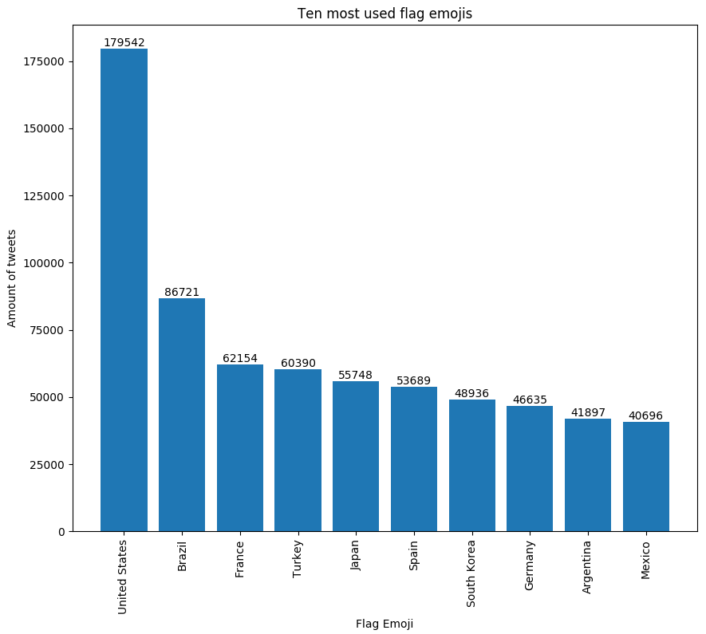
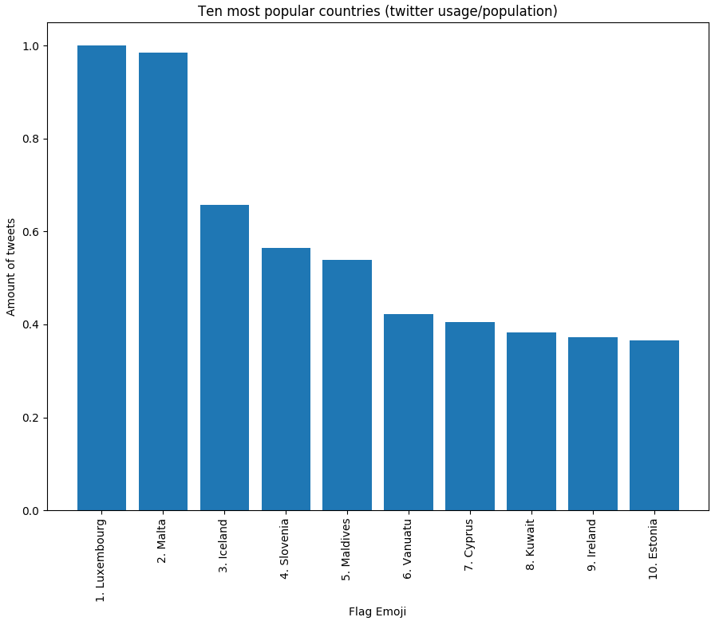
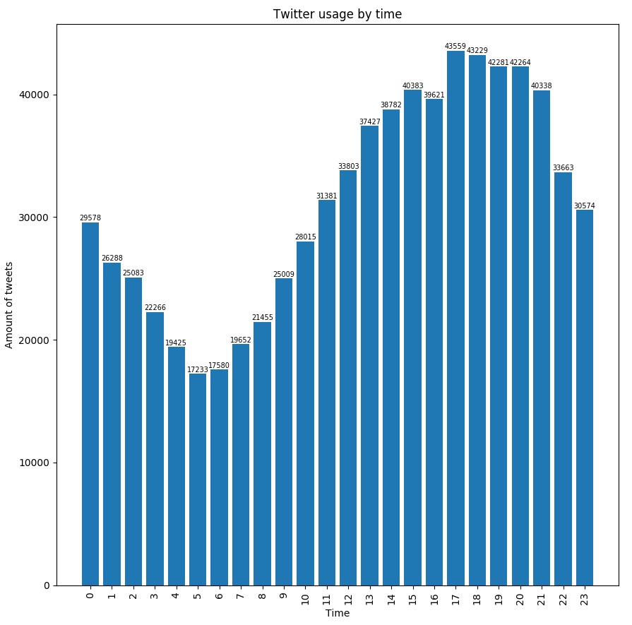
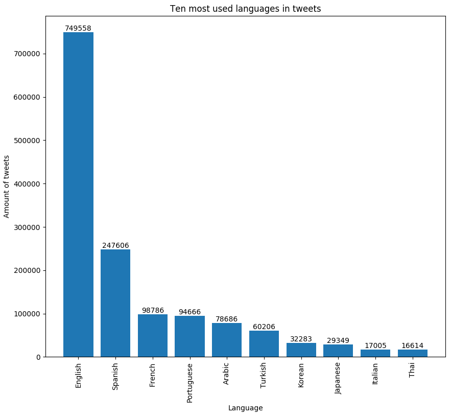
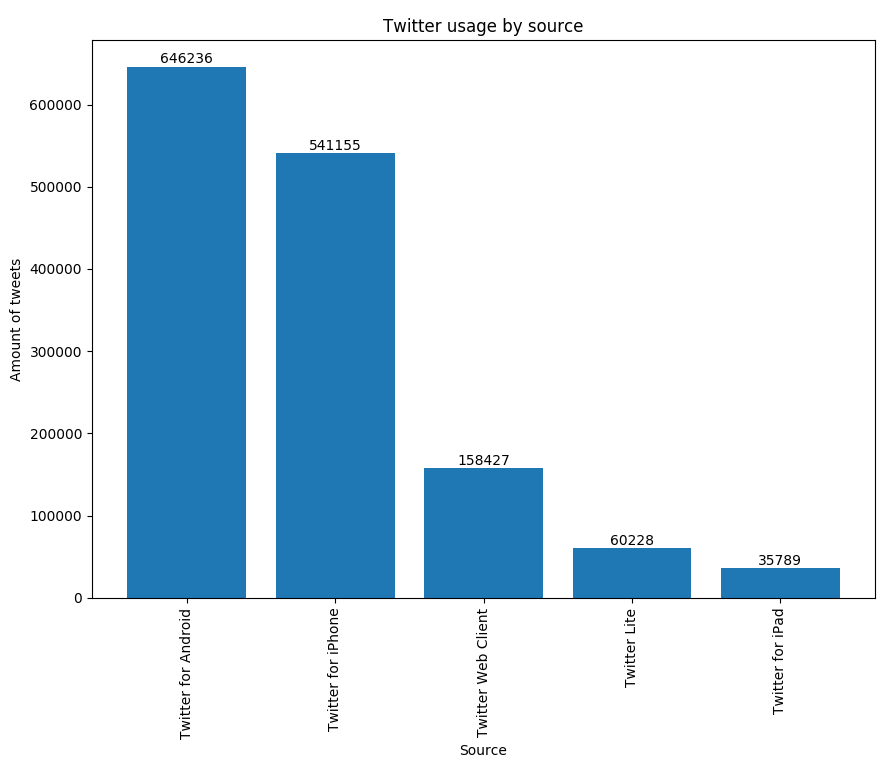

# PyTwitter - Word usage on twitter analyzed

# Sources

Tweets from the Twitter API, regionPopulation.csv and countryPopulation.csv taken from data.worldbank.org.

Uses the python libraries tweepy, matplotlib and pycountry.

# Results

Some results from 1.5 million tweets containing emoji flags are dumped in the files results.txt and resultsNormalized.txt. 

# Some results graphed

